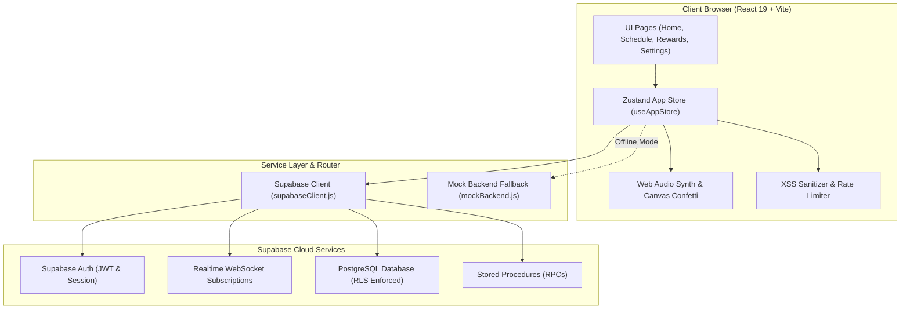

# 🐾 TAMED (Puppy Schedule)

> **The Ultimate Gamified Routine Tracking, Behavioral Positive Reinforcement & Reward Management Ecosystem for Couples & Partners.**

[](https://react.dev/)
[](https://vitejs.dev/)
[](https://supabase.com/)
[](https://pages.cloudflare.com/)
[](https://oxc.rs/)
[](LICENSE)

---

## 🌟 Welcome to Tamed

**Tamed** (formerly *Puppy Schedule*) is a state-of-the-art, mobile-first web application created to transform daily routine logging, accountability, and relationship dynamics into an engaging, gamified experience. 

Built with **React 19**, **Vite 5**, **Zustand 5**, and powered by **Supabase PostgreSQL** with real-time sync, Tamed bridges the gap between daily discipline and playful rewards. Whether tracking habits, setting daily routines, issuing real-time praise, or redeeming custom treats, Tamed delivers a tailored experience for both **Master / Owner** and **Pet / Submissive** roles.

```
       ┌─────────────────────────────────────────────────────────────┐
       │   👑 OWNER DASHBOARD           🦊 PET DASHBOARD              │
       │   • Calendar Status (G/Y/R)    • Interactive Mascot Avatar   │
       │   • Daily Behavior Codex       • Level & XP Bar              │
       │   • Reward Item Catalog        • Custom Currency (Bones 🦴)  │
       │   • Instant Praise Sender      • Store Redemptions & Requests│
       │   • Security PIN Verification  • Habit Checklists            │
       └──────────────────────────────┬──────────────────────────────┘
                                      │
                 ┌────────────────────┴────────────────────┐
                 │       ⚡ HYBRID ENGINE (ZUSTAND)         │
                 │   Realtime Supabase + Offline Demo Mode │
                 └────────────────────┬────────────────────┘
                                      │
                 ┌────────────────────┴────────────────────┐
                 │  🗄️ SUPABASE POSTGRES (RLS SECURITY)    │
                 │   Row-Level Security & Encrypted Auth   │
                 └─────────────────────────────────────────┘
```

---

## 📑 Index of Sections

- [🐾 TAMED (Puppy Schedule)](#-tamed-puppy-schedule)
  - [🌟 Welcome to Tamed](#-welcome-to-tamed)
  - [📑 Index of Sections](#-index-of-sections)
  - [💎 Product Vision \& Executive Overview](#-product-vision--executive-overview)
  - [⚡ Deep Product Breakdown \& Feature Catalog](#-deep-product-breakdown--feature-catalog)
    - [1. Dual-Persona Architecture (Owner vs. Pet)](#1-dual-persona-architecture-owner-vs-pet)
    - [2. Interactive Mascot \& Gamification Engine](#2-interactive-mascot--gamification-engine)
    - [3. Species-Custom Currencies \& Economic System](#3-species-custom-currencies--economic-system)
    - [4. Calendar Status Logging \& Historic Tracking](#4-calendar-status-logging--historic-tracking)
    - [5. Daily Behavior Codex (Routines \& Tasks)](#5-daily-behavior-codex-routines--tasks)
    - [6. Reward Store, Proposals \& Redemption Flow](#6-reward-store-proposals--redemption-flow)
    - [7. Praise Transmitter \& Audio-Visual FX](#7-praise-transmitter--audio-visual-fx)
    - [8. Reminders \& Instant Nudge Engine](#8-reminders--instant-nudge-engine)
    - [9. Multi-Persona Aesthetic Theme Engine](#9-multi-persona-aesthetic-theme-engine)
    - [10. Security PIN \& Safeguard System](#10-security-pin--safeguard-system)
  - [🔬 Technical Review \& System Architecture](#-technical-review--system-architecture)
    - [1. Technology Stack Overview](#1-technology-stack-overview)
    - [2. System Architecture Diagram](#2-system-architecture-diagram)
    - [3. Database Schema \& Entity Relationships](#3-database-schema--entity-relationships)
    - [4. Row-Level Security (RLS) Policy Audit](#4-row-level-security-rls-policy-audit)
    - [5. Offline-First \& Mock Engine Fallback](#5-offline-first--mock-engine-fallback)
  - [📖 User Operational Guides](#-user-operational-guides)
    - [Guide 1: Initial Onboarding \& Pair Connection](#guide-1-initial-onboarding--pair-connection)
    - [Guide 2: Daily Routine Logging \& Points Calculation](#guide-2-daily-routine-logging--points-calculation)
    - [Guide 3: Customizing Rewards \& Processing Redemptions](#guide-3-customizing-rewards--processing-redemptions)
    - [Guide 4: Sending Praise Notes \& Head Pats](#guide-4-sending-praise-notes--head-pats)
    - [Guide 5: Security PIN Setup \& Lockout Recovery](#guide-5-security-pin-setup--lockout-recovery)
  - [🛠️ Developer \& Setup Guides](#️-developer--setup-guides)
    - [1. Prerequisites](#1-prerequisites)
    - [2. Local Development Setup](#2-local-development-setup)
    - [3. Environment Variables Configuration](#3-environment-variables-configuration)
    - [4. Supabase Database Deployment](#4-supabase-database-deployment)
    - [5. Building, Previewing \& Linting](#5-building-previewing--linting)
    - [6. Cloudflare Pages Deployment](#6-cloudflare-pages-deployment)
  - [🔌 API \& Technical Reference](#-api--technical-reference)
    - [PostgreSQL Stored Procedures (RPCs)](#postgresql-stored-procedures-rpcs)
    - [Utility Module Inventory](#utility-module-inventory)
    - [Zustand State Store Map](#zustand-state-store-map)
  - [🎨 Design System \& Aesthetics](#-design-system--aesthetics)
  - [❓ Troubleshooting \& Frequently Asked Questions](#-troubleshooting--frequently-asked-questions)
  - [📄 License \& Credits](#-license--credits)

---

## 💎 Product Vision & Executive Overview

Modern routine tracking apps are rigid, clinical, and impersonal. **Tamed** re-imagines routine tracking as a cooperative, intimate game between two individuals. 

### Key Pillars of Tamed:
1. **Gamified Positive Reinforcement**: Every completed routine generates experience points (XP), advances pet level progression, and earns custom virtual currency.
2. **Dual-Role Symmetry**: Tailored interface layouts for Owners (administrative control, routine management, approval privileges) and Pets (mascot interaction, task completion, reward redemption).
3. **Mascot Personality Engine**: An animated SVG mascot avatar (`Puppy`, `Kitty`, `Fox`, or custom creatures) that shifts moods (`Happy`, `Playful`, `Sleepy`, `Proud`, `Neutral`, `Sad`) based on completed tasks and calendar logs.
4. **Safety & Security First**: Built-in 4-digit Security PIN protection for administrative actions, database-level lockout mechanisms, XSS input sanitization, and rate-limiting safeguards.
5. **Universal Accessibility & Themes**: Mobile-optimized touch layout with dynamic CSS persona variable engines support Dark, Light, Pastel, and customizable HSL/HEX color schemes.

---

## ⚡ Deep Product Breakdown & Feature Catalog

### 1. Dual-Persona Architecture (Owner vs. Pet)
Tamed features two distinct UI modes driven by the active profile's `role` field:
- **👑 Master / Owner Mode**: 
  - Direct control over calendar status logging (Green, Yellow, Red).
  - Ability to adjust point balances manually or award instant bonus points.
  - Full CRUD authority over the Reward Catalog and Daily Tasks.
  - Approval/Denial portal for pet redemption requests and proposed new reward items.
  - Dedicated Praise Transmitter to send instant head pats or praise cards.
- **🦊 Pet / Submissive Mode**:
  - Live animated Mascot Avatar with mood indicators.
  - XP progress bar showing current level and progress toward the next level threshold.
  - Interactive Daily Codex checklist to mark routines complete.
  - Reward Store browsing with point balance indicators and instant redemption requests.
  - Ability to propose new reward items to the Owner.

### 2. Interactive Mascot & Gamification Engine
The `MascotAvatar.jsx` component provides a visual connection to routine progress:
- **Species Variants**: Puppy 🐶, Kitty 🐱, Fox 🦊, or Custom Emoji 🐰/🐲/🐼.
- **Dynamic Mood States**:
  - **Happy**: Standard upbeat mood.
  - **Playful**: Triggered upon earning praise or completing tasks.
  - **Sleepy**: Evening state or low activity.
  - **Proud**: Achieved upon level up or consecutive green calendar days.
- **Leveling Formula**: XP thresholds scale dynamically (`Level * 100 XP`). Completing tasks grants +25 XP, logging green calendar status grants +50 XP.

### 3. Species-Custom Currencies & Economic System
Currency in Tamed is customizable per pairing:
- **Pre-set Currencies**:
  - **Puppy**: Bones 🦴
  - **Kitty**: Fish 🐟
  - **Fox**: Berries 🫐
  - **Custom**: Stars ⭐, Cookies 🍪, Hearts 💖, or custom text.
- **Weekend Multiplier**: Owners can set weekend point multipliers (e.g., 1.5x or 2.0x) to encourage consistent weekend routine compliance.

### 4. Calendar Status Logging & Historic Tracking
The `Calendar.jsx` module tracks daily behavioral compliance:
- **🟢 Green Status**: Excellent routine adherence (awards full configurable point value + XP).
- **🟡 Yellow Status**: Moderate day (awards partial configurable points).
- **🔴 Red Status**: Needs improvement (0 points awarded).
- **Historical Snapshots**: Point values awarded are snapshotted in `calendar_entries.points_awarded` to preserve historical record integrity even if global point values are modified later.

### 5. Daily Behavior Codex (Routines & Tasks)
Owners can define recurring daily tasks for the Pet:
- **Task Attributes**: Title, XP reward value (+25 XP default), date tag, completion state.
- **Interactive Checklists**: Pets check off tasks in real time. Task completions trigger Web Audio chimes and particle confetti celebrations.

### 6. Reward Store, Proposals & Redemption Flow
The reward economy is fully closed-loop:
1. **Catalog Management**: Owners create store items with defined point costs.
2. **Pet Proposals**: Pets can submit custom proposals for items they wish to see in the store. Owners approve or deny proposals.
3. **Redemptions**: Pets redeem store items using earned points. Redemptions enter `pending` status until the Owner approves or denies them.
4. **Automated Balance Auditing**: Points are deducted upon redemption request and refunded if denied.

### 7. Praise Transmitter & Audio-Visual FX
- **Instant Praise Card**: Owners can transmit "Head Pats" 🤚, "Treats" 🍖, or custom praise notes with personalized pet terms (e.g., "Good Boy", "Good Girl", "Clever Fox").
- **Web Audio Synthesizer**: Custom Web Audio API synthesizer (`audio.js`) creates soft procedural audio chimes without external audio assets.
- **Canvas Confetti Engine**: Native HTML5 Canvas particle explosion system (`confetti.js`) triggers on reward redemptions and task completion milestones.

### 8. Reminders & Instant Nudge Engine
The `RemindersSection.jsx` component manages timing and check-ins:
- **Scheduled Daily Reminders**: Configurable evening check-in time (default `21:00`).
- **Instant Nudges**: Owners can send instant browser notifications or in-app popups to prompt daily check-ins.

### 9. Multi-Persona Aesthetic Theme Engine
Driven by `theme.js` and CSS custom variables (`index.css`):
- **Puppy Theme**: Vibrant Violet (`#8b5cf6`) primary accents.
- **Kitty Theme**: Playful Pink (`#ec4899`) primary accents.
- **Fox Theme**: Warm Amber (`#f59e0b`) primary accents.
- **Custom Theme**: Custom primary/accent HEX picker supporting Light, Dark, and Soft Pastel modes.

### 10. Security PIN & Safeguard System
Sensitive administrative actions (clearing history, adjusting points, logging calendar status, resetting pairings) are secured by `PinModal.jsx`:
- **4-Digit PIN Security**: Requires Owner PIN confirmation.
- **Brute-Force Lockout**: Tracks failed attempts (`failed_pin_attempts`) and locks access for 15 minutes after 5 consecutive failures.

---

## 🔬 Technical Review & System Architecture

### 1. Technology Stack Overview

| Layer | Technology | Description |
| :--- | :--- | :--- |
| **Frontend Framework** | React 19 (`react`, `react-dom`) | Modern component hierarchy utilizing hooks and concurrent rendering capabilities. |
| **Build Tooling** | Vite 5 (`vite`, `@vitejs/plugin-react`) | Ultra-fast HMR and bundle optimization engine. |
| **State Management** | Zustand 5 (`zustand`) | Centralized state store with persistence middleware and dual-backend logic. |
| **Routing** | React Router 7 (`react-router-dom`) | Client-side view routing. |
| **Backend & Database** | Supabase (`@supabase/supabase-js`) | PostgreSQL database with Row-Level Security (RLS), Auth & WebSockets. |
| **Styling & Icons** | Vanilla CSS + Tailwind Merge | Custom CSS custom properties design system with `lucide-react` icons. |
| **Code Quality** | Oxlint (`oxlint`) | Ultra-fast JavaScript/JSX linter. |
| **Deployment** | Cloudflare Pages | Edge distribution with instant global CDN invalidation. |

---

### 2. System Architecture Diagram



---

### 3. Database Schema & Entity Relationships

The PostgreSQL database structure in `supabase-schema.sql` defines 9 core tables and 7 custom ENUM types:

```
  ┌─────────────────┐       ┌─────────────────┐       ┌──────────────────┐
  │    PROFILES     │       │    PAIRINGS     │       │ CALENDAR_ENTRIES │
  ├─────────────────┤       ├─────────────────┤       ├──────────────────┤
  │ id (PK UUID)    │◄──────┤ owner_id (FK)   │   ┌───┤ id (PK UUID)     │
  │ uid (TEXT)      │       │ pet_id (FK)     │◄──┼───┤ pairing_id (FK)  │
  │ role (ENUM)     │       │ point_values... │   │   │ entry_date (DATE)│
  │ xp / level      │       └────────┬────────┘   │   │ status (ENUM)    │
  │ points_balance  │                │            │   └──────────────────┘
  └─────────────────┘                │            │
                                     ├───► REWARD_ITEMS
                                     ├───► REWARD_PROPOSALS
                                     ├───► REDEMPTIONS
                                     ├───► DAILY_TASKS
                                     ├───► PRAISE_NOTES
                                     └───► REMINDERS
```

#### Database Tables Summary:
1. `profiles`: User accounts, roles (`owner` | `pet`), XP, level, points balance, mood, and custom theme settings.
2. `pairings`: Links an Owner profile to a Pet profile with 6-digit pair code, point multipliers, and currency configs.
3. `calendar_entries`: Daily Green/Yellow/Red status logs tied to a pairing.
4. `reward_items`: Active items available for redemption in the Reward Store catalog.
5. `reward_proposals`: Pet-submitted suggestions for new store rewards.
6. `redemptions`: Purchase logs when a Pet spends points on a store item.
7. `daily_tasks`: Routine checklist items created by the Owner.
8. `praise_notes`: Log of transmitted praise cards, head pats, and affection notes.
9. `reminders`: Scheduled check-in reminder times and instant nudge logs.

---

### 4. Row-Level Security (RLS) Policy Audit

All database tables have Row-Level Security explicitly enabled. Security helper function `is_user_in_pairing(p_pairing_id)` guarantees isolation:

```sql
CREATE OR REPLACE FUNCTION is_user_in_pairing(p_pairing_id UUID)
RETURNS BOOLEAN AS $$
  SELECT EXISTS (
    SELECT 1 FROM public.pairings 
    WHERE id = p_pairing_id 
    AND (owner_id = auth.uid() OR pet_id = auth.uid())
  );
$$ LANGUAGE sql SECURITY DEFINER;
```

#### Security Highlights:
- **Profile Isolation**: Users can update their own profiles. Owners can additionally manage their paired Pet's profile parameters.
- **Pairing Scope**: Calendar entries, reward items, daily tasks, praise notes, and redemptions are strictly restricted to members of the specific pairing.
- **Role Isolation**: Only Owners can write calendar logs, edit store items, or approve redemptions. Pets are restricted to creating proposals and submitting redemption requests.

---

### 5. Offline-First & Mock Engine Fallback

To support immediate demo exploration without requiring a live Supabase backend, Tamed incorporates a full in-memory mock engine (`src/services/mockBackend.js`). 

If environment variables `VITE_SUPABASE_URL` or `VITE_SUPABASE_ANON_KEY` are not detected, `supabaseClient.js` gracefully falls back to local storage and mock state, enabling full testing and UI previewing out of the box.

---

## 📖 User Operational Guides

### Guide 1: Initial Onboarding & Pair Connection

1. **Create Account / Choose Role**:
   - Launch the application and complete the onboarding step.
   - Select your persona: **👑 Master / Owner** or **🦊 Pet / Submissive**.
   - Select species archetype (Puppy, Kitty, Fox, or Custom) and customize nickname and theme.

2. **Generate / Enter Pairing Code**:
   - The **Owner** navigates to **Settings** and views their generated 6-digit Pair Code (e.g. `849201`).
   - The **Pet** enters this 6-digit PIN code on their onboarding screen.
   - Click **Connect Pair**. Once connected, both dashboards synchronize instantly.

---

### Guide 2: Daily Routine Logging & Points Calculation

```
   ┌─────────────────────────────────────────────────────────────┐
   │                    DAILY LOGGING WORKFLOW                   │
   │                                                             │
   │  1. Pet completes Daily Tasks ──► +25 XP per task           │
   │  2. Owner checks progress ────► Reviews task checklist      │
   │  3. Owner logs Calendar Day ──► 🟢 Green (+1 Point, +50 XP) │
   │                                 🟡 Yellow (0 Points)        │
   │                                 🔴 Red (0 Points)           │
   └─────────────────────────────────────────────────────────────┘
```

1. **Pet Task Completion**: Pets mark completed items in their **Daily Codex**. Completing tasks awards +25 XP per task.
2. **Owner Evening Check-In**: The Owner opens the **Schedule / Calendar** tab.
3. **Log Calendar Status**:
   - Click the current date on the calendar.
   - Choose **Green**, **Yellow**, or **Red**.
   - Optional: Enter daily feedback notes.
   - Click **Save Log**. The Pet's point balance updates immediately based on pairing settings.

---

### Guide 3: Customizing Rewards & Processing Redemptions

1. **Creating Rewards (Owner)**:
   - Go to **Rewards Store** -> Click **+ Add Reward Item**.
   - Enter item name (e.g. *"Back Massage (20 Mins)"*), description, and point cost (e.g. `5 Bones`).
   - Save item to publish it to the store catalog.

2. **Redeeming Items (Pet)**:
   - Navigate to **Rewards Store** -> Browse catalog.
   - Click **Redeem** on an item. The point cost is held in pending status.

3. **Approving Redemptions (Owner)**:
   - The Owner receives a redemption request notification.
   - Open **Requests** tab -> Click **Approve** (deducts points permanently and triggers confetti) or **Deny** (refunds points to Pet).

---

### Guide 4: Sending Praise Notes & Head Pats

1. Navigate to **Home** or **Schedule** tab.
2. Click **Praise Pet** 🤚.
3. Choose Praise Type:
   - **Head Pat** 🤚: Sends a playful affection chime.
   - **Treat** 🍖: Grants bonus points/XP.
   - **Praise Card** 💌: Write a custom encouraging note.
4. Click **Send Praise**. The Pet receives a pop-up modal celebration with audio synthesizer sounds.

---

### Guide 5: Security PIN Setup & Lockout Recovery

1. **Setting Security PIN**:
   - Navigate to **Settings** -> **Security & PIN**.
   - Enter a 4-digit numeric Security PIN.
2. **Enforcing PIN Protection**:
   - Sensitive actions (adjusting point totals, clearing history, deleting store items) will prompt for the Security PIN.
3. **Lockout Safeguard**:
   - Entering an incorrect PIN 5 consecutive times locks PIN validation for 15 minutes to prevent unauthorized access.

---

## 🛠️ Developer & Setup Guides

### 1. Prerequisites
- **Node.js**: `v18.0.0` or higher
- **npm**: `v9.0.0` or higher
- **Git**: Installed and configured on your system
- **Supabase Account**: (Optional for production cloud database)
- **Cloudflare Account**: (Optional for production web hosting)

---

### 2. Local Development & Personal GitHub Repository Setup

#### Step 1: Clone the Official Repository
```bash
# 1. Clone the official Tamed repository
git clone https://github.com/NottKoneko/Tamed.git
cd Tamed

# 2. Install project dependencies
npm install

# 3. Start local development server
npm run dev
```
The local development application will be running at `http://localhost:5173`.

#### Step 2: Push to Your Own GitHub Repository for Hosting & Customization
To host your own deployment on Cloudflare Pages or make custom modifications, create a new repository on GitHub and link your local clone to it:

```bash
# 1. Create a new empty repository on GitHub (e.g., https://github.com/<YOUR_GITHUB_USERNAME>/<YOUR_REPOSITORY_NAME>)

# 2. Change the git origin URL to point to your new GitHub repository
git remote set-url origin https://github.com/<YOUR_GITHUB_USERNAME>/<YOUR_REPOSITORY_NAME>.git

# 3. Push all code to your main branch
git branch -M main
git push -u origin main
```

---

### 3. Environment Variables Configuration

Copy `.env.example` to create your local `.env` file:

```bash
cp .env.example .env
```

Configure `.env` with your Supabase credentials:

```env
# Production Supabase API Connection
VITE_SUPABASE_URL=https://your-project-id.supabase.co
VITE_SUPABASE_ANON_KEY=your-actual-anon-key-here
```

---

### 4. Supabase Database Deployment

To deploy the schema to your Supabase PostgreSQL instance:

1. Log into your [Supabase Dashboard](https://supabase.com/dashboard).
2. Create a new project or select an existing one.
3. Navigate to **SQL Editor** -> Click **New Query**.
4. Open [supabase-schema.sql](file:///c:/Code%20Projects/PetOwner%20Site/supabase-schema.sql) in your code editor, copy all contents, paste into SQL Editor, and click **Run**.
5. Verify tables (`profiles`, `pairings`, `calendar_entries`, etc.) and functions are successfully created under `public` schema.

---

### 5. Building, Previewing & Linting

```bash
# Run Oxlint code quality verification
npm run lint

# Build production bundle
npm run build

# Preview production build locally
npm run preview
```

---

### 6. Cloudflare Pages Deployment

Deploy directly using your personal or organization GitHub repository:

1. Push your codebase to your own GitHub repository (`https://github.com/<YOUR_GITHUB_USERNAME>/<YOUR_REPOSITORY_NAME>`).
2. Log into your [Cloudflare Dashboard](https://dash.cloudflare.com/) -> **Workers & Pages**.
3. Click **Create Application** -> **Pages** -> **Connect to Git**.
4. Authorize Cloudflare to access your GitHub account and select your repository (`<YOUR_GITHUB_USERNAME>/<YOUR_REPOSITORY_NAME>`).
5. Configure build parameters:
   - **Framework Preset**: `Vite`
   - **Build Command**: `npm run build`
   - **Build Output Directory**: `dist`
6. Add your Environment Variables under **Settings -> Environment Variables**:
   - `VITE_SUPABASE_URL`: Your Supabase Project URL
   - `VITE_SUPABASE_ANON_KEY`: Your Supabase Public Anon Key
7. Click **Save and Deploy**. Your custom instance will now automatically build and deploy whenever you push to your `main` branch!


---

## 🔌 API & Technical Reference

### PostgreSQL Stored Procedures (RPCs)

| RPC Name | Parameters | Purpose |
| :--- | :--- | :--- |
| `rpc_log_calendar_day` | `p_pairing_id`, `p_date`, `p_status`, `p_notes` | Atomically updates/inserts calendar day status and awards configured points. |
| `rpc_submit_redemption` | `p_pairing_id`, `p_reward_id`, `p_points_spent` | Validates pet point balance and creates pending redemption entry. |
| `rpc_approve_redemption`| `p_redemption_id` | Approves pending redemption and deducts points from pet balance. |
| `rpc_deny_redemption` | `p_redemption_id` | Denies pending redemption and releases held points back to pet balance. |
| `rpc_verify_pairing_pin`| `p_pairing_id`, `p_entered_pin` | Verifies security PIN against brute-force threshold and records audit logs. |

---

### Utility Module Inventory

Located under `src/utils/`:

- [audio.js](file:///c:/Code%20Projects/PetOwner%20Site/src/utils/audio.js): Web Audio API procedural chime synthesizer.
- [confetti.js](file:///c:/Code%20Projects/PetOwner%20Site/src/utils/confetti.js): Native HTML5 Canvas particle confetti system.
- [currency.js](file:///c:/Code%20Projects/PetOwner%20Site/src/utils/currency.js): Currency formatter and species icon mapping helper.
- [dateUtils.js](file:///c:/Code%20Projects/PetOwner%20Site/src/utils/dateUtils.js): Date formatting and timezone compliance helpers.
- [notifications.js](file:///c:/Code%20Projects/PetOwner%20Site/src/utils/notifications.js): Web Notification API integration for instant nudges.
- [rateLimiter.js](file:///c:/Code%20Projects/PetOwner%20Site/src/utils/rateLimiter.js): Client-side throttling for requests and PIN attempts.
- [sanitizer.js](file:///c:/Code%20Projects/PetOwner%20Site/src/utils/sanitizer.js): XSS input string sanitizer for notes, proposals, and usernames.
- [theme.js](file:///c:/Code%20Projects/PetOwner%20Site/src/utils/theme.js): HSL/HEX dynamic CSS property injection engine.
- [updateStacker.js](file:///c:/Code%20Projects/PetOwner%20Site/src/utils/updateStacker.js): Optimistic state update batcher for smooth UI responsiveness.

---

### Zustand State Store Map

Centralized in [useAppStore.js](file:///c:/Code%20Projects/PetOwner%20Site/src/store/useAppStore.js):

- **User & Auth State**: `session`, `user`, `pairProfile`, `pairing`
- **Dashboard State**: `activeTab`, `calendarEntries`, `rewardItems`, `proposals`, `redemptions`, `dailyTasks`, `praiseNotes`
- **UI & Modal Controls**: `toast`, `pinModalOpen`, `activePraiseModal`, `requestModalOpen`
- **Core Actions**: `loadInitialData()`, `setRole()`, `logCalendarDay()`, `submitProposal()`, `approveRedemption()`, `sendPraise()`

---

## 🎨 Design System & Aesthetics

Tamed employs a modern, mobile-first design system driven by CSS Custom Properties (`src/index.css`):

```css
:root {
  --color-primary: #8b5cf6;
  --color-primary-dark: #7c3aed;
  --color-accent: #ec4899;
  --color-bg: #faf5ff;
  --color-card: #ffffff;
  --radius-lg: 1.25rem;
  --shadow-soft: 0 10px 25px -5px rgba(139, 92, 246, 0.1);
  --transition-smooth: all 0.25s cubic-bezier(0.4, 0, 0.2, 1);
}
```

- **Typography**: Clean system UI sans-serif stack (`system-ui`, `-apple-system`, `BlinkMacSystemFont`).
- **Glassmorphism**: Backdrop blur effects for navigation headers and sticky action banners.
- **Touch Targets**: Min 44px touch targets optimized for iOS Safari and Android Chrome.

---

## ❓ Troubleshooting & Frequently Asked Questions

<details>
<summary><b>Q: How do I reset a lost Security PIN?</b></summary>
<p>
If connected to Supabase, an Owner can reset their Security PIN directly in the <code>profiles</code> table by updating the <code>pairing_pin</code> column, or by using the reset PIN option in the <b>Settings</b> tab after confirming account credentials.
</p>
</details>

<details>
<summary><b>Q: Can I use Tamed without a Supabase cloud database?</b></summary>
<p>
Yes! Tamed automatically falls back to an offline local storage mock engine if <code>VITE_SUPABASE_URL</code> is not provided in environment variables. All features can be evaluated locally.
</p>
</details>

<details>
<summary><b>Q: How are level-ups calculated?</b></summary>
<p>
XP accumulation follows a progressive formula: <code>Level = Math.floor(Total_XP / 100) + 1</code>. Completing daily tasks grants +25 XP, and logging Green calendar days grants +50 XP.
</p>
</details>

---

## 📄 License & Credits

Designed with ❤️ for couples and partners seeking fun, gamified structure.

- **License**: [MIT License](LICENSE)
- **Icons**: [Lucide React](https://lucide.dev/)
- **Repository**: [https://github.com/NottKoneko/Tamed](https://github.com/NottKoneko/Tamed)
